# Lista de Herramientas

Es necesario contar con una determinada cantidad de herramientas
básicas para el dictado de esta materia y que seguramente les servirán
para el resto de su carrera.

## Multímetro

El [multímetro](https://es.wikipedia.org/wiki/Mult%C3%ADmetro) o
*tester* es el principal instrumento requerido. Este dispositivo nos
permite realizar la medición de diferentes parámetros eléctricos. A
continuación se muestran tres tipos diferentes:

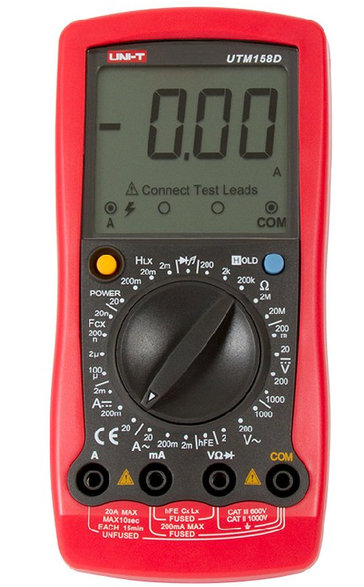
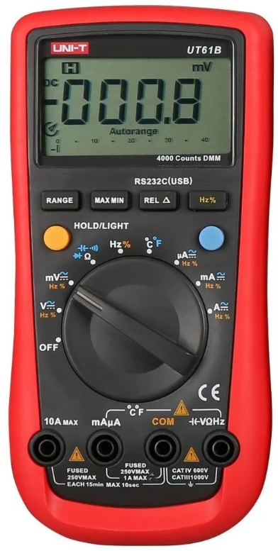
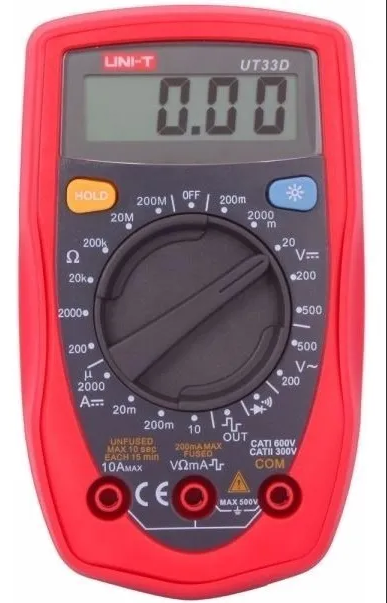

Los multímetros anteriormente son simplemente una referencia debido a
su precio/calidad y la disponiblidad en el mercado local. A
continuación un vídeo que explica sobre la selección de multímetro:

Entre las variedades de instrumentos y marca se debe prestar atención
a las especificaciones y limitaciones de algunos productos publicados
en la web. A continuación se pueden ver dispositivos que no son
recomendados.

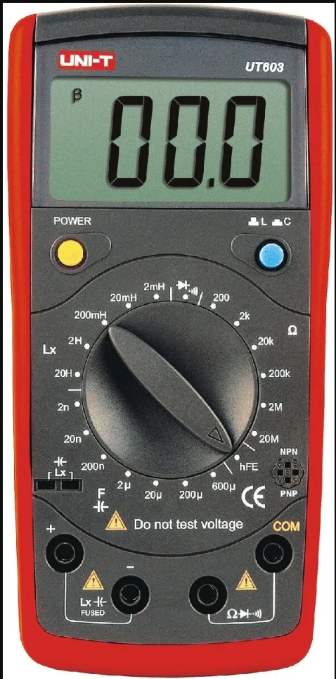
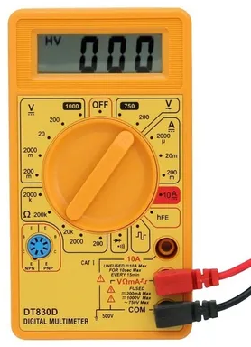

## Soldador

El soldador es otro de las herramientas fundamentales para esta
materia. Existe una gran variedad y técnicas de soldado según la
aplicación. En este
[link](https://toolboom.com/es/articles-and-video/how-to-solder/) se
detallan algunas características de los soldadores. Al igual que los
multímetros, se debe ser criterioso a la hora de selccionar un
soldador. La recomendación desde nuestra cátedra será considerar
utilizar los soldadores de lápiz de una potencia entre 40W y 60W.

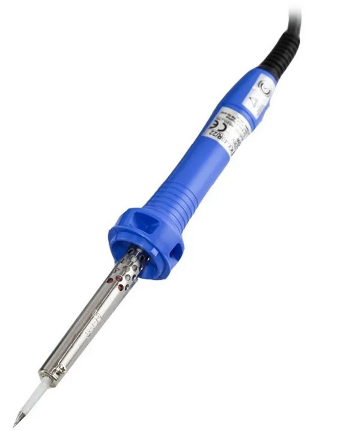
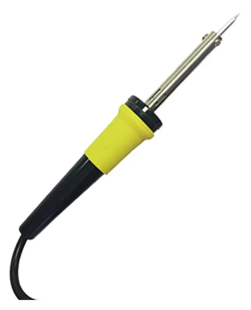

Existe también soldadores de lapiz que **no son recomendados** debido
a su mala calidad, principalmente en su punta de soldado.

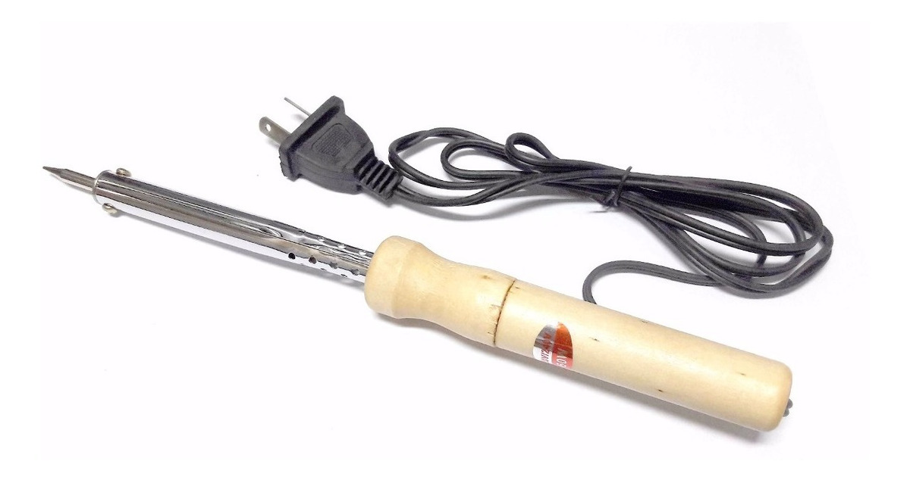

En el siguiente vídeo se pueden ver algunas recomendaciones con
respecto a la ténica de soldadura utilizando el soldador
recomendado. Sí bien en clases se darán las instrucciones para
realizar esta tarea, en base al vídeo podrían comenzarse con las
prácticas en sus casa.

## Desoldador

En el proceso de formación se encontrará con situaciones que requiera
retirar un elemento que se encuentre ya soldado. O también se necesite
corregir una soldadura y eso podría implicar retirar el estaño en una
zona específica de la placa. En estos casos se pueden utilizar un
desoldador o cinta desoldante.
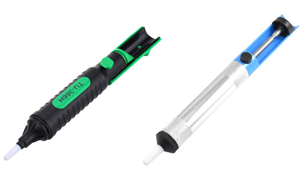
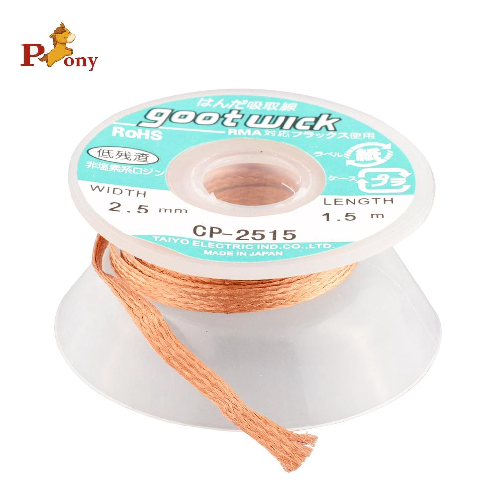

<!-- En el siguiente vídeo se puede ver la técnica para utilizar estos -->
<!-- elementos. -->

<!--  -->

## Pinza y Alicate

Respecto a estas dos herramientas de mano, es fundamental que se
intente adquirir aquellas que nos permitan manipular elementos
pequeños. Es por esta razón que se recomienda adquirir de los
siguientes tipos.
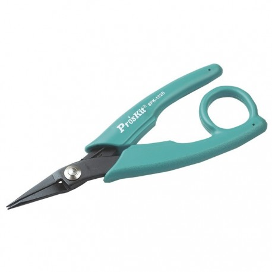
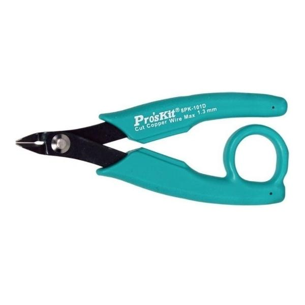
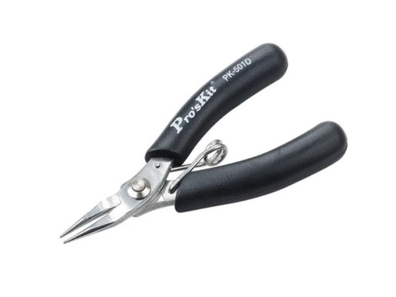
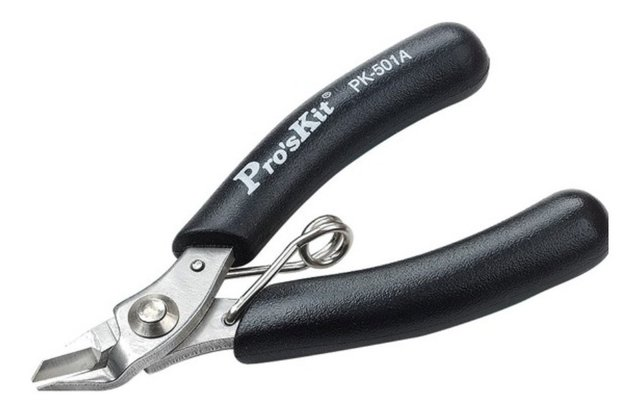

Recuerde que estas herramientas debe ser utilizadas únicamente cuando
se esté manipulando elementos de pequeñas dimensiones y en caso de
cable, de pequeñas secciones. Siguiendo estos criterios sus
herramientas tendrán mayor durabilidad.

## Brucelas

Este tipo de herramienta son secundarias, se utilizan mucho en caso de
avanzar con la práctica en electrónica. Existen juegos completos de
brucelas pero recomendamos comenzar con una básica como se puede ver
a continuación.

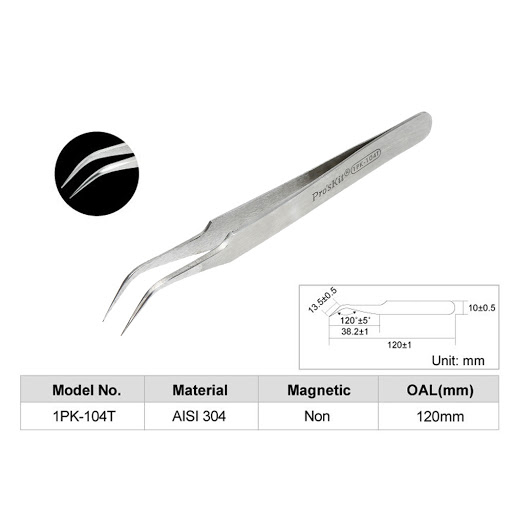

## Otros

Existen una extensa lista de otras herramientas que sería útiles en su
ejercitación en electrónica como son:

- Destornilladores de baja sección (~3mm)
- flux/decapante
- soporte para desoldador
- pasta para limpiar soldador

